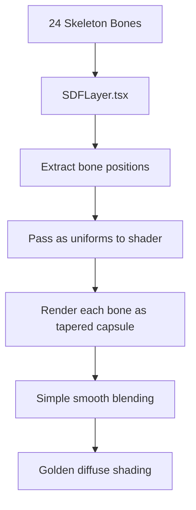
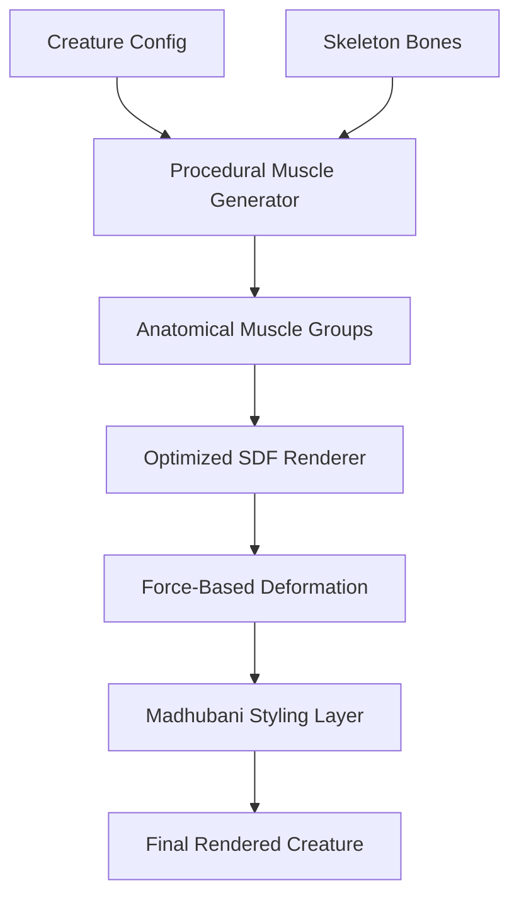
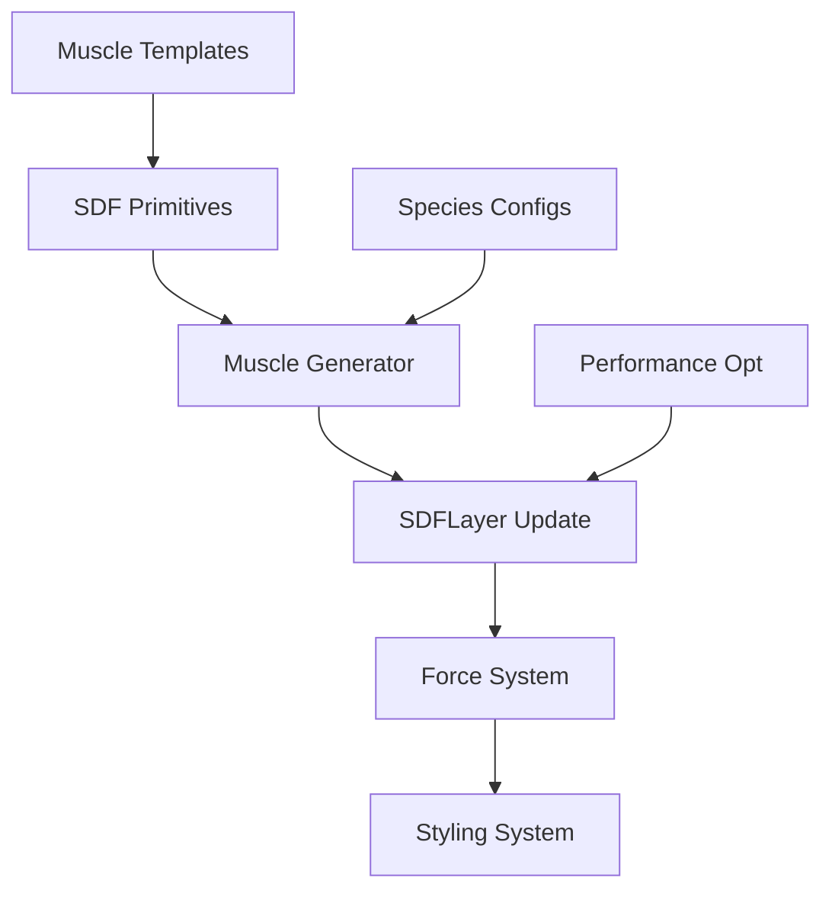

# SPEC PRP: Anatomical 3D SDF Muscle System Transformation

## Executive Summary

Transform the current bone-centric SDF rendering approach into an anatomical, cross-species muscle system that uses biomechanically accurate muscle groups crossing joints, with scalable configuration for multiple species.

## Current State Assessment

### Existing Implementation

**Files:**
- `mechquadruped/components/sdf/SDFLayer.tsx` - React component for SDF rendering
- `mechquadruped/components/sdf/HorseSDFShader.ts` - GLSL shaders with basic SDF functions
- `mechquadruped/components/sdf/README.md` - Documentation of current status

**Current Behavior:**


**Identified Issues:**
1. **Anatomical Inaccuracy**: Muscles don't cross joints like real muscles
2. **Visual Quality**: Appears as disconnected spheres, not organic form
3. **Scalability**: Hard-coded for horse, species-specific
4. **Performance**: Raymarching 24 individual SDFs inefficiently
5. **Artistic Limitation**: No pathway for Madhubani styling integration

## Desired State Architecture

### Target Behavior



### New Architecture Components

1. **Muscle Template System**: Scalable templates for different muscle types
2. **Cross-Species Config**: Parameter-driven muscle generation
3. **Optimized SDF Pipeline**: GPU-efficient muscle rendering
4. **Force Deformation Engine**: Realistic muscle dynamics
5. **Stylization Framework**: Madhubani pattern integration

## Hierarchical Objectives

### High-Level Objective
Create a scalable, anatomical muscle system that produces visually stunning, biomechanically accurate creatures for multiple species.

### Mid-Level Objectives

1. **Anatomical Accuracy**
   - Implement muscle groups that cross joints
   - Use appropriate SDF primitives for different muscle types
   - Add force-based deformation

2. **Scalability Framework**
   - Configuration-driven muscle generation
   - Species-agnostic muscle templates
   - Easy addition of new creatures

3. **Performance Optimization**
   - Reduce SDF operations through muscle grouping
   - Implement LOD system
   - Optimize raymarching

4. **Artistic Integration**
   - Madhubani styling system
   - Pattern mapping to muscle groups
   - Cultural art fusion

### Low-Level Tasks

#### Phase 1: Core Architecture (Foundation)

**Task 1.1: Create Muscle Template System**
```yaml
action: CREATE
file: mechquadruped/systems/muscle/MuscleTemplate.ts
changes: |
  - Define MuscleTemplate interface with types: fusiform, pennate, sheet, complex
  - Create MuscleGroup class for organizing muscles
  - Implement MuscleParameters for scaling and shaping
validation:
  - command: "npm run type-check"
  - expect: "No TypeScript errors"
```

**Task 1.2: Implement Anatomical SDF Primitives**
```yaml
action: CREATE
file: mechquadruped/shaders/sdf/MusclePrimitives.glsl
changes: |
  - sdFusiform(): Spindle-shaped muscles (biceps, triceps)
  - sdPennate(): Feather-like muscles (deltoids, gluteals)
  - sdSheetMuscle(): Flat sheets (longissimus dorsi)
  - sdComplexMuscle(): Multi-belly muscles (hamstrings)
  - psmin(): Polynomial smooth minimum for natural blending
validation:
  - command: "npm run test-shaders"
  - expect: "All SDF functions compile and render correctly"
```

**Task 1.3: Create Muscle Configuration System**
```yaml
action: CREATE
file: mechquadruped/configs/HorseMuscles.ts
changes: |
  - Define 15 anatomical muscle groups for horse
  - Specify origin/insertion points using bone IDs
  - Add shape parameters for each muscle type
validation:
  - command: "node -e 'require(\"./configs/HorseMuscles.ts\")'"
  - expect: "Valid muscle configuration loaded"
```

#### Phase 2: Implementation (Core Features)

**Task 2.1: Implement Muscle Generator**
```yaml
action: CREATE
file: mechquadruped/systems/muscle/MuscleGenerator.ts
changes: |
  - Parse muscle configuration
  - Generate GLSL code from templates
  - Create optimized SDF combining functions
validation:
  - command: "npm run build"
  - expect: "Muscle generator compiles successfully"
```

**Task 2.2: Transform SDFLayer for Muscle Rendering**
```yaml
action: MODIFY
file: mechquadruped/components/sdf/SDFLayer.tsx
changes: |
  - Replace bone iteration with muscle group processing
  - Pass muscle parameters as uniforms
  - Implement force-based deformation parameters
validation:
  - command: "npm run dev"
  - expect: "SDF layer renders with muscle groups"
```

**Task 2.3: Create Cross-Species Muscle System**
```yaml
action: CREATE
file: mechquadruped/systems/muscle/CrossSpeciesMuscles.ts
changes: |
  - Implement scalable muscle template system
  - Create CreatureMuscleConfig interface
  - Add species-specific overrides
validation:
  - command: "npm run test:muscles"
  - expect: "All species configs validate correctly"
```

#### Phase 3: Advanced Features (Enhancement)

**Task 3.1: Implement Force-Based Deformation**
```yaml
action: CREATE
file: mechquadruped/systems/physics/ForceDeformer.ts
changes: |
  - Analyze skeleton movement for muscle forces
  - Calculate stretch/compression/twist values
  - Generate deformation parameters for shader
validation:
  - command: "npm run test:physics"
  - expect: "Force calculations match expected values"
```

**Task 3.2: Add Madhubani Styling System**
```yaml
action: CREATE
file: mechquadruped/shaders/styling/MadhubaniPatterns.glsl
changes: |
  - Implement procedural pattern generators
  - Create UV mapping for 3D surfaces
  - Add pattern blending with muscle types
validation:
  - command: "npm run test:patterns"
  - expect: "Patterns render correctly on SDF surfaces"
```

**Task 3.3: Optimize Performance**
```yaml
action: MODIFY
file: mechquadruped/components/sdf/HorseSDFShader.ts
changes: |
  - Implement LOD system with distance-based detail
  - Add early exit optimizations
  - Optimize raymarching loop
validation:
  - command: "npm run benchmark"
  - expect: "Maintain 60fps with complex creatures"
```

## Implementation Strategy

### Dependencies



### Implementation Order

1. **Foundation First**: Templates → Primitives → Generator
2. **Integration Next**: SDFLayer modification
3. **Enhancement Last**: Physics → Styling → Optimization

### Rollback Plan

- Each phase maintains backward compatibility
- Feature flags enable/disable new systems
- Current bone-based SDF remains as fallback

## Risk Assessment

### Technical Risks

1. **Shader Complexity**
   - Risk: WebGL2 instruction limit exceeded
   - Mitigation: LOD system, feature splitting

2. **Performance Degradation**
   - Risk: Muscle SDFs slower than bone capsules
   - Mitigation: GPU optimization, distance culling

3. **Integration Complexity**
   - Risk: Breaking existing skeleton system
   - Mitigation: Adapter pattern, gradual migration

### Mitigation Strategies

1. **Incremental Development**: Phase-based approach
2. **Performance Monitoring**: Built-in FPS counters
3. **Fallback Systems**: Bone SDF as emergency backup
4. **Extensive Testing**: Unit tests for each component

## Success Metrics

### Technical Metrics
- 60fps at 1080p with 3 creatures on screen
- <100ms compile time for new creature configs
- <5MB GPU memory usage for muscle data

### Quality Metrics
- Visual muscle deformation matches reference anatomy
- Smooth species morphing without artifacts
- Madhubani patterns align with muscle flow

### Scalability Metrics
- Add new species via config only (<30 lines)
- Support for 10+ creature types
- <50ms runtime generation for new muscles

## Testing Strategy

### Unit Tests
- Muscle template generation
- SDF primitive accuracy
- Configuration validation

### Integration Tests
- Skeleton-muscle binding
- Cross-species generation
- Performance benchmarks

### Visual Tests
- Screenshot comparisons with reference renders
- Animation smoothness validation
- Pattern alignment verification

## Appendices

### A. Muscle Type Reference

| Muscle Type | Function | SDF Primitive | Example |
|-------------|----------|---------------|---------|
| Fusiform | Primary movement | Tapered capsule with bulge | Biceps |
| Pennate | Power/stability | Fan-shaped | Deltoid |
| Sheet | Posture/support | Flat sheet | Longissimus |
| Complex | Multi-direction | Combined primitives | Hamstrings |

### B. Configuration Schema

```typescript
interface CreatureMuscleConfig {
  overallScale: number;
  bodyType: 'slender' | 'muscular' | 'stocky';
  muscleGroups: {
    axial: { mass: number, definition: number };
    limbs: { mass: number, definition: number };
    neck: { mass: number, length: number };
    tail: { mass: number, thickness: number };
  };
}
```

### C. Performance Targets

| Component | Target | Measurement |
|-----------|--------|-------------|
| SDF Raymarching | 100 steps max | Per pixel |
| Muscle Generation | 50ms | CPU time |
| GPU Memory | 5MB | Total usage |
| Draw Calls | 1 | Per creature |

## Next Steps

1. **Immediate**: Begin Phase 1 implementation with muscle templates
2. **Week 1**: Complete SDF primitives and basic muscle shapes
3. **Week 2**: Integrate with existing SDFLayer
4. **Week 3**: Add force deformation and Madhubani styling
5. **Week 4**: Performance optimization and cross-species testing

---

*This SPEC PRP provides a clear transformation path from the current bone-based SDF system to an anatomical, scalable muscle system that supports multiple species and artistic styling.*